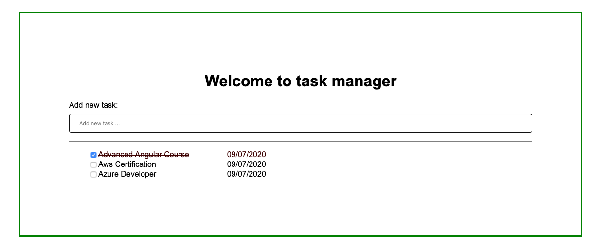

# angular-spring-boot-task-app 

Angular 10 task manager app; connected to Spring boot backend. 
Create and complete tasks.



#### Features 
- Single-page application 
- Initial data load 
- Frontend packaged with backend via webpack

## 

## Application Stack

Stack  | version |
--- | --- |  
*Java* | 1.8 
*SpringBoot* | 2.3.1.RELEASE
*Frontend* | Angular 10
*Node* | v12.18.1
*DB* | h2-database (in memory)
*Server* | Tomcat (embedded)
*Build Tool* | Maven
*CI* | n/a 
*Code Coverage* | n/a
*Build env* | (embedded)

## Application Set-up

#### h2
JDBC URL: jdbc:h2:mem:tasks

#### Angular
npm install --save-dev rimraf
npm install --save-dev mkdirp
npm install --save-dev copyfiles

npm install -g @angular/cli
cd src/main
ng new frontend

## Application Run
````
cd src/main/frontend
npm run start 
````
http://localhost:4200

Spring Boot: `com.malik.ithar.task.Application.class`
http://localhost:8080/api/tasks

## Application Build 
```
cd src/main/frontend
npm run build
--------------------------------------
com.malik.ithar.task.Application.class
```

## Application URL
http://localhost:8080

## Application profile
-Dspring.profiles.active=unit-tests
-Dspring.profiles.active=integration-tests

## Further enhancements 
